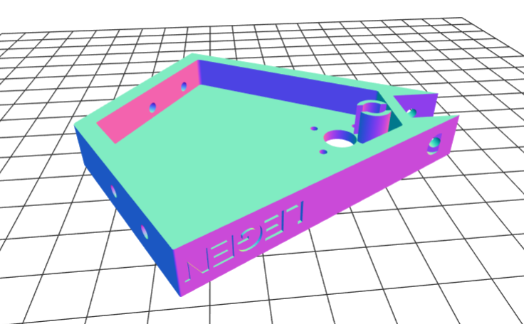
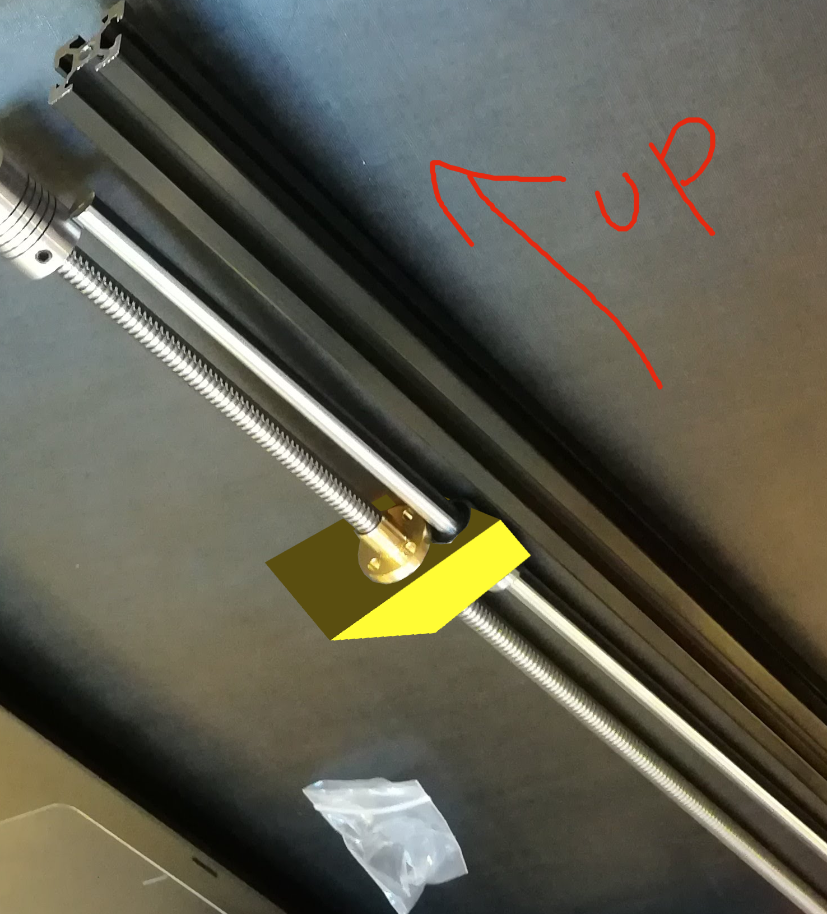

# Printer

This repository is for the LegendaryOctoSniffle design group. The LegendaryOctoSniffle will be a new 3D delta printer design, inspired by the RepRap [Kossel](http://reprap.org/wiki/Kossel) and [3DR](http://reprap.org/wiki/3DR). The printer will be designed around lead-screw drives and magnetic effector joints.

This repository will ultimately include models, images, instructions, parts lists, etc., for the construction of the LegendaryOctoSniffle. Presently, it contains coordinating instructions for the design group who will be creating these materials.

## Goals

The primary design goals will be simplicity of assembly and simplicity of design: the LegendaryOctoSniffle will include a 3D printed structural top and base (inspired by the 3DR), magnetic effector joints, and a lead-screw drive. Aside from waiting for glue to dry, a practiced individual should be able to assemble the LegendaryOctoSniffle in one hour; a novice should be able to assemble it in less than four hours.

A secondary goal of the LegendaryOctoSniffle is to be a [RepRap machine](http://reprap.org/wiki/RepRap_Machines), like the Kossel, 3DR, and other machines that it is inspired by. The main requirement for this goal will be the licensing restrictions of any parts that the design group borrows from: GPL licensed parts will certainly be compatible with the RepRap project, and other licenses may also be suitable.

Another secondary goal of the printer is that it should be inexpensive. The basic build cost will be under $300.

## Audience

This repository currently supports the people who are designing the printer. It is anarchic, chaotic, and informal!

At some point, this repository might become a kind of reproducible design/learning experience for designing your own 3D printer.

## Structure

We will meet once a month for 4 or 5 months. The basic structure will be:

1. We'll buy some parts for the upcoming meeting.
2. We'll explore the function of those parts.
3. (Optional) We'll design the 3D printed parts necessary to assemble your purchased parts together. You can contribute to the design of these parts or just use other people's designs. Multiple people can independently design their own parts, working alone or together with others. And in the end, we don't have to settle on one "final" design: different people can use different solutions that they like best. Additionally, some parts can be taken directly from existing designs on the internet.
4. Send me your designs a week before the next meeting, and I'll have them printed for you. Or you can print them on your own if you have access to a 3D printer through a library, or work, etc.

## Schedule

### [Meeting 01: March 11th, 1:00PM, Study Room 5, Foster Business Library, University of Washington](meeting-01/)
### [Meeting 02: April 8th, 1:00PM-3:00PM, Suzallo Library Room 334, University of Washington](meeting-02/)
### [Meeting 03: July 7th. 1:00PM-3:00PM. University of Washington Campus (Suzallo 333)](meeting-03/)
### [Meeting 04: August 4th. 1:00PM-4:00PM. Radius Apartments rooftop common area (400 Boren Ave N, Seattle--SLU)](meeting-04/)

