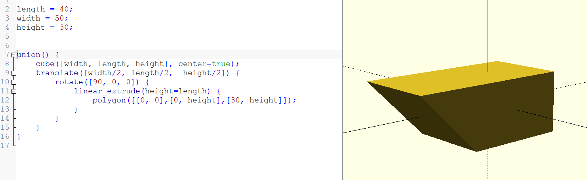
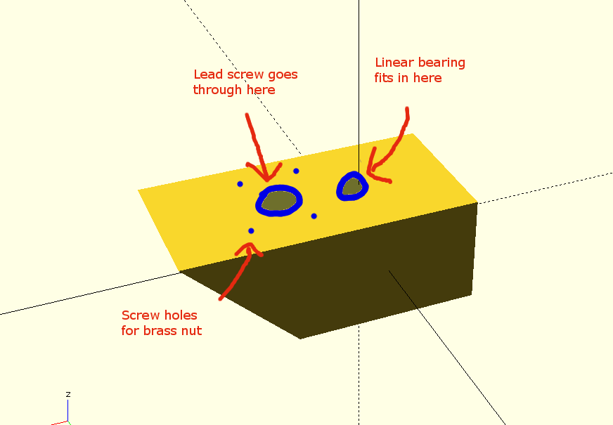
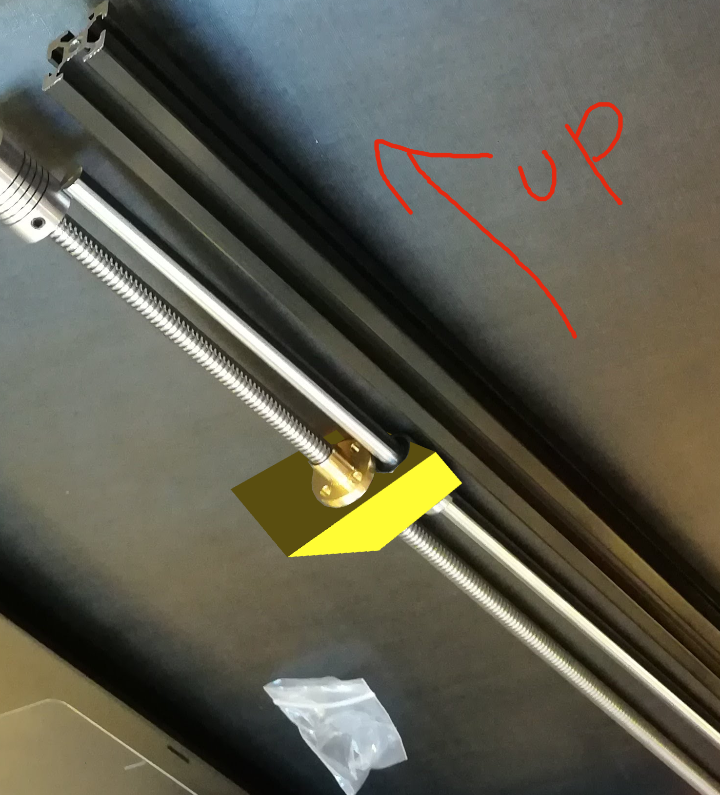
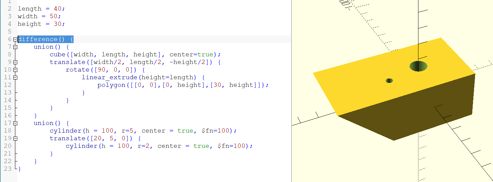

Thanks to Kayla 🤘 for taking pictures and video, throughout Joe's explanations on how we'll be constructing 🏗️ the printer legs.

## Designing the Carriage

Below is a sketch for a very basic design of the carriage/sled.

The sled has to:
  1. Hold on to the linear bearing (which slides up and down the smooth rod)
  2. Provide screw holes for the brass lead-screw nut and a hole for the lead-screw to go through.
  3. Have that 45 to 60 degree overhang.

If it fits that, it will do its job. I've provided an example SCAD with the basic shape, but it can be made taller or skinnier, or wider, etc. At the very least, you'll have to subtract out the holes. For example:

Putting the two holes closer together is better than further apart, but they don't have to be too close together. Also, cool looking is better than not cool looking. And it's like 10 cents worth of plastic, so we can revise it once you see it printed and put together.

You can use a ruler to get the exact milimeter measurements of the parts, or you can guess. In any case, use variables as much as you can so that we can easily make changes.

For the screw holes, use a radius of 1mm.

I've also uploaded a SCAD with some example holes through it.

See the SCAD itself for some helpful comments.

And the carriage SCADs are in the carriage directory.

### Problems Rendering in OpenSCAD?

Especially with Windows? I had [this problem](https://github.com/openscad/openscad/issues/1591), and resolved it with the "force Goldfeather" advice.

### Your Carriages

Push them into the march-11-meetup/carriages directory! I'll print them a week before the next meetup.
