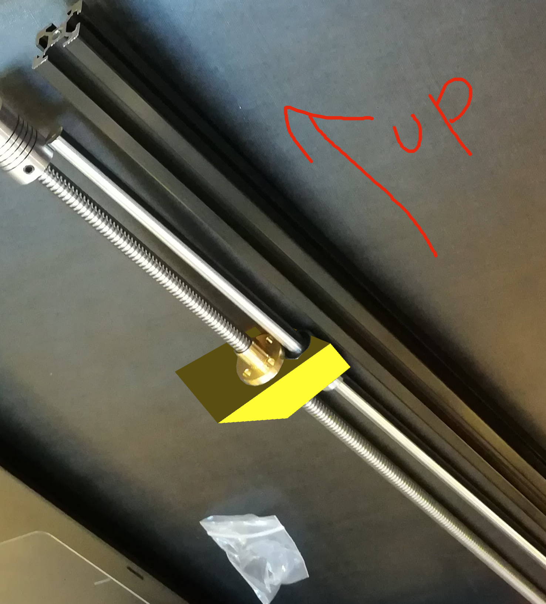

Thanks to Kayla 🤘 for taking pictures and video, throughout Joe's explanations on how we'll be constructing 🏗️ the printer legs.

# Meeting 01

#### [See pics/vid from this meetup](https://github.com/LegendaryOctoSniffle/Printer/tree/master/meeting-01)

## Before the Meeting

Go ahead and purchase your [initial parts for meeting 01](#parts). I've received mine, and I'm excited! You might not have to bring all of your parts every time, but for this one do bring all of the parts that you receive. I received mine within a week of my order, but if you haven't received all of them by March 11th it won't be a big problem.

I'll refer to [this video](https://youtu.be/KroO4_xwKcs) to explain some of the parts that we'll be buying. Some of the parts and mechanisms will be different, but the basics will be the same.

The goal for the first meeting will be to create a working sled drive, minus the 3D printed parts. In the video above, the sleds are the orange things moving up and down the square rails.

The printer in the video uses a belt drive: the sleds are attached to a belt which is turned by motors in the base of the printer. The printer that we're making won't be using a belt: it will use a heavy threaded rod that's specially designed for driving precision movements.

## Parts

For our first meeting, we'll be assembling one "leg" of our printer. Though the parts list below is sufficient for one leg of the printer, we'll eventually be ordering three of all of the quantities provided below.

* T8x2 Leadscrew w/nut (400mm) (x1)
  This will be the threaded rod that will move each of our sleds up and down. We'll couple the motor to one end, and secure the length of the rod with a bearing that lets it turn freely. The x2 doesn't mean to buy 2 (yet), it designates the number of threads on the rod. [Ebay](https://www.ebay.com/itm/322001200138?var=510932183194)
* 8mm pillow block bearing. (x2)
  These are the bearings that will keep the rod aligned in place while letting it turn freely. Buy two. [Ebay](https://www.ebay.com/itm/2X-8mm-pillow-block-Self-aligning-bearing-mounted-support-3D-printer-CNC-Reprap-/322008974125). The linked item is a 2 pack: you can buy just one two pack. [Alternate Ebay listing](https://www.ebay.com/itm/2pcs-KP08-P08-8mm-Diameter-Bore-Self-Aligning-Pillow-Block-Bearing-/132306260310): if the first listing sells out, you can buy also buy this from the seller of the LM8UU bearings.
* 2020 Aluminum Extrusion (600mm) (x1)
  A mainstay of 3D printer construction. You'll see why. We'll use these as the vertical supports for our printer, connecting its structural top and bottom. [Ebay](https://www.ebay.com/itm/322880737350)
* Stepper Motor (Nema17, 1.7A) (x1)
  Stepper motors are built for precise, strong movement. Nema is a common standard for sizing stepper motors, and there are various Nema sizes. Additionally, stepper motors are rated by amperage. We'll be using a 1.7A Nema17 motor. [Ebay](https://www.ebay.com/itm/321966121485)
* 5mm to 8mm shaft coupler (x1)
  These will couple the 5mm shaft of our drive motor to the 8mm leadscrew. [Ebay](https://www.ebay.com/itm/321966928277)
* Endstop Switch (x1)
  When the printer first turns on, it doesn't know how far up or down the sleds are on the rods. To find out, it moves the sleds all the way up the rods until they make contact with a switch. When the sleds make contact with the switch, the printer knows the exact position of the sled: it's at the top of its rod. [Ebay](http://r.ebay.com/yveNca) The linked item is a three pack: it's got all the endstop switches we'll need for all three legs of the printer.
* 8mm by 400mm guide rod (x1)
  To drive our sled up and down, we'll mount it to the turning lead screw. But in order to keep the sled from turning, we'll need a second rod to guide it. [Ebay](https://www.ebay.com/itm/322454805576). We won't be making any other purchases from this seller, so I would recommend buying all three now.
* LM8UU 8mm linear bearing (x1)
  For our sled to slide up and down the guide rod, we'll need to equip it with a linear bearing. [Ebay](https://www.ebay.com/itm/141843551594) The linked item is a four pack. We'll need three total for all three legs, so you'll get them all in this one purchase.
  
Most of the items that I've linked to are sold by Zyltech. We'll be making most of our subsequent purchases from Zyltech as well. Some of their items offer a combined shipping discount. If you want to take advantage of free shipping then you can order up to three of all of the items I've listed from Zyltech, unless it's already a multipack: we'll need them for the other two legs.

## Designing the Carriage

Below is a sketch for a very basic design of the carriage/sled.

The sled has to:
  1. Hold on to the linear bearing (which slides up and down the smooth rod)
  2. Provide screw holes for the brass lead-screw nut and a hole for the lead-screw to go through.
  3. Have that 45 to 60 degree overhang.

If it fits that, it will do its job. I've provided an example SCAD with the basic shape, but it can be made taller or skinnier, or wider, etc. At the very least, you'll have to subtract out the holes. For example:

Putting the two holes closer together is better than further apart, but they don't have to be too close together. Also, cool looking is better than not cool looking. And it's like 10 cents worth of plastic, so we can revise it once you see it printed and put together.

You can use a ruler to get the exact milimeter measurements of the parts, or you can guess. In any case, use variables as much as you can so that we can easily make changes.

For the screw holes, use a radius of 1mm.

I've also uploaded a SCAD with some example holes through it.

See the SCAD itself for some helpful comments.

And the carriage SCADs are in the carriage directory.

### Problems Rendering in OpenSCAD?

Especially with Windows? I had [this problem](https://github.com/openscad/openscad/issues/1591), and resolved it with the "force Goldfeather" advice.

### Your Carriages

Push them into the /carriages directory! I'll print them a week before the next meetup.
